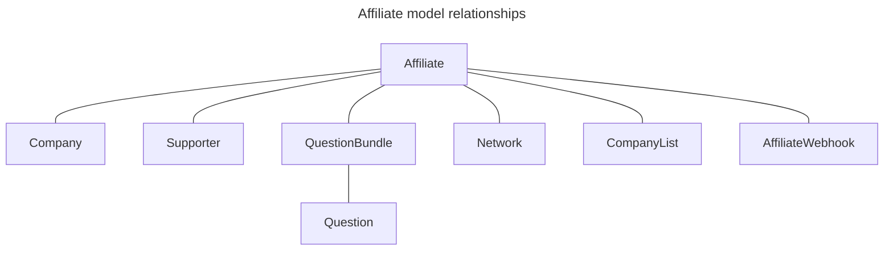

# Affiliates

Affiliates (also referred to as Affiliate Flows) are a core feature of Abaca. These are, basically, customized forms. At the moment, all existing Affiliates are managed by the platform Administrator – there is no UI on the frontend to create or update them, only to make submissions.

## Model Implementation

The Affiliate model, defined in `viral/models/affiliate.py`, is one of the most complex entities in Abaca. Here is a breakdown of its properties:

- `name` is the title of the Affiliate, displayed to the users
- `shortcode` and `slug` are identifiers used in the Affiliate's public URLs. The slug is generated automatically, based on the shortcode
- `website` and `logo` are the Affiliate owner's branding. During submission, this logo is displayed in the page header, with a link to the website
- `email` and `additional_emails` are addresses to where notifications are sent upon each submission
- `spreadsheet` is the URL of the Google Sheet where submission data is automatically recorded
- `company` is many-to-one relationship with the `Company` model, representing the owner of the Affiliate (each affiliate is owned by a single company, a company can own multiple affiliates)
- `flow_type` identifies the type of Affiliate:
    - `0` is a self-assessment flow
    - `1` is a program (question bundle) flow
- `flow_target` identifies the type of users who can make submissions to the Affiliate:
    - `0` for Entrepreneurs
    - `1` for Supporters
- `default_flow` is a boolean value that identifies the default Affiliate that is presented to Supporters during registration. There is validation in place to guarantee there is only one default Affiliate
- `supporters` and `networks` are many-to-many relationships with the `Supporter` and `Network` models, respectively. The implications of these relationships explained further ahead
- `webhooks` is a many-to-many relationship to the `AffiliateWebhook` model. These webhooks are called when new submissions are received
- `question_bundles` is a many-to-many relationship to the `QuestionBundle` model. This indirectly defines which questions (`Question` model) are part of the Affiliate (only applies to the program flow type)
- `company_lists` is a many-to-many relationship to the `CompanyList` model. Users who submit an Affiliate are automatically added to its related Company Lists
- `show_team_section` is a boolean flag that determines wether or not a "Team Members" step is presented to users
- `summary`, `disclaimer_heading`, `disclaimer_body`, `self_assessment_step_description`, `self_assessment_step_note`, `questions_step_description`, `questions_step_note`, `team_members_step_description` and `team_members_step_note` are all text fields to customize the copy displayed to the users

## Affiliate steps

Affiliates can have up to four different steps, depending on their configuration. First step is always the same for all Affiliates – the self-assessment – in which:

- Entrepreneurs set a level for each VIRAL category
- Supporters set the level range they’re interested in

The remaining three steps are displayed conditionally, depending on the Affiliate’s properties.

If the Affiliate is a Program Flow (`flow_type = 1`), next step is where the Questions can be answered. For Self-Assessment Affiliates (`flow_type = 0`) this step is skipped. Both Entrepreneurs and Supporters answer the exact same questions, although copy and answer data types can be adapted to each one (this is configured on the `Question` model itself).

Next, there is the Team Members step, which is displayed only if the Affiliate has the property `show_team_sectoion = True`. Data for this step is pre-filled with the account data and, if updated, the changes will also be persisted in the account.

Lastly, there is the Interests step, which appears only on Affiliates targeted to Supporters (`flow_target = 1`). It allows the user to define Sectors and Locations of interest. Once again, answers are pre-filled, and changes will be persisted in the account.

## Affiliate Program Flows (Question Bundles)

As mentioned above, Affiliates that have `flow_type = 1` are Program Flows and have some key characteristics:

- They must include, at least, one Question Bundle (not targeted for team members)
- They can be associated with Affiliate Webhooks, to which the submission data is sent after each submission.
- They must be associated with, at least, a Supporter (`supporters` field) or a Network (`network` field).

## Affiliate Webhooks

If there are Affiliate Webhooks associated with an Affiliate, upon each submission, the submission data gets sent by Abaca to the endpoint defined in each Webhook. This logic is implemented with the `send_data_to_affiliate_webooks()` listener on the `finished_affiliate_flow` Django signal, in `/rest-api/viral/signals.py` .

## Affiliate Networks

If there are Networks associated with an Affiliate, Entrepreneurs who submit to it get automatically added to these Networks. This logic is implemented with the `add_networks_to_entrepreneur_list()` listener on the `finished_affiliate_flow` Django signal, in `/rest-api/viral/signals.py` .

## Affiliate Supporters

Associating Supporters with an Affiliate affects other modules, such as Matching, Milestone Planner and Company Lists. These impacts are described in each module’s respective docs.