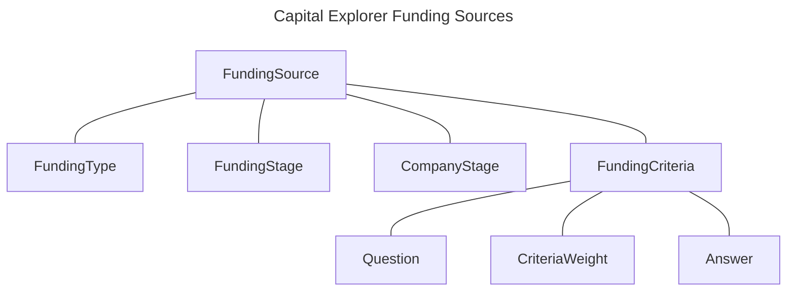

# Capital Explorer

The purpose of this feature is presenting Entrepreneurs the most appropriate source of funding for their companies, using an algorithm based on answers provided to a set of close-ended questions.

The latest submission of each user is stored in the database so they can come back without having to fill everything again from scratch.

Additionally, Capital Explorer submissions can also be shared, similar to Company Lists and Milestone Planner (public link, passcode, invited users and invited guests).

Any `matching.models.QuestionBundle` that has `capital_explorer == True` will be included in the Capital Explorer.

Sources of funding are grouped in types, which are represented by the `FundingType` model, of which two instances were pre-added: *Non-dilutive* and *Dilutive*.

The current situation of a company is one of the factors to consider here, and that’s represented by the `FundingStage`. Again, two values are available by default: *Revenue generating* and *Pre-revenue*.

The stage of development of a company – `CompanyStage` model – is also decisive. Available values are *Concept, Early, Growth, Scaling and Established.*

These three models have many to many relationships with the main model that represents sources of funding – `FundingSource`. A few examples are *Equity, Recoverable Grants, Revenue-Based Loans* and *Venture Debt.*

Last, but not least, we have the `FundingCriteria` model, which acts as a bridge between funding sources and the questions/answers that affect the results of the algorithm.

Just like in the Matching module, each criteria has an associated weight, represented by the `CriteriaWeight` model (i.e. *Irrelevant, Very Important, Extremely Important*).

The following diagram summarizes how all these models relate to each other:

While Capital Explorer is a relatively complex feature, the backend for it is pretty basic, since all the algorithm’s logic is implemented in the frontend (results are computed and updated in real-time, as the user submits each additional answer). This means the only API endpoints we have are for retrieving the Funding Sources data, to load existing submissions and to store updated ones.