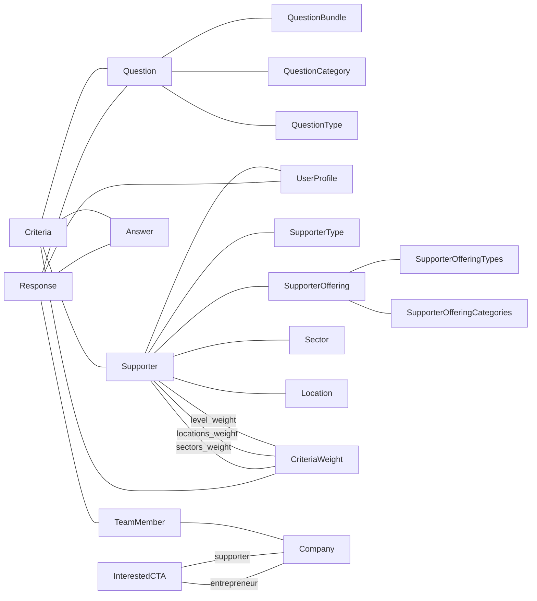

# Matching

Matching is, by far, the most complex module in Abaca, so there’s really a lot to unpack here. The following diagram is an attempt to represent how most models involved in Matching relate to each other.

## Models overview

Let’s start with the two entities that, as the name of the feature implies, *match* with each other – Entrepreneurs and Supporters. These are both represented by the `Company` model, with `type = 0` and `type = 1` respectively. However, Supporters have a few additional properties, so there is also a dedicated `Supporter` model. It has a one-to-one relationship with `UserProfile`, which in turn also has a relationship of the same kind with `Company`. Here’s a breakdown of the properties of `Supporter`:

- `is_active` – boolean flag, Supporter is hidden if set to `False`
- `name`
- `about`
- `email`
- `types` – many-to-many relationship with `SupporterType` (e.g. Investor, Accelerator…)
- `user_profile` – one-to-one relationship with `UserProfile`
- `locations` – many-to-many relationship with `Location`, through `SupporterInterestLocation`
- `sectors` – many-to-many relationship with `Sector`, through `SupporterInterestSector`
- `investing_level_range` – VIL values the Supporter is interested in, any range between 1 to 9, included
- `locations_weight` – many-to-one relation with `CriteriaWeight`
- `level_weight` – many-to-one relation with `CriteriaWeight`
- `sectors_weight` – many-to-one relation with `CriteriaWeight`

The algorithm that calculates a match score between Entrepreneurs and Supporters is based on multiple criteria – meaning some expected value on the Entrepreneur and the respective weight, not all criteria have the similar relevance.

There are three fixed criteria, common to all Supporters, represented directly in this model:

- `locations`, and the corresponding `locations_weight`
- `sectors`, and the corresponding `sectors_weight`
- `investing_level_range`, and corresponding `level_weight`

Alongside these three, Supporters can define additional criteria that take into account the Answers of Entrepreneurs to specific Questions. This allows for great diversity and complexity, as many different combinations are possible.

These criteria are represented by the `Criteria` model, which relates with `CriteriaWeight`, `Supporter`, `Question` and `Answer` – for single and multi-select questions, these are the expected answers. For questions that have a different type, there is also a `desired` property which accepts a few different formats of JSON –  e.g. `{"text": ...}`, `{"value": 20}` or `{"min": 5, "max": 15}`).

Further ahead we’ll analyze how exactly the algorithm works, producing a concrete match score ranging from 0% to 99%.

## Algorithm

The calculation is done by cross-checking Entrepreneurs’ answers and Supporters’ criteria and verifying which ones match. The Criteria Weights assigned to each criteria determine how many points are added when there is a match. At the time of writing, these are the values:

- Irrelevant – 0 points
- A Little Important – 1 point
- Somewhat Important – 10 points
- Very Important – 50 points
- Extremely Important – 250 points

However, the algorithm also contemplates some form of penalization in cases where there is no match, and also cases when there is missing data from the Entrepreneur, as they might have not answered a particular question yet. The magnitude of these penalizations depends on which version of the algorithm is being used. In the `matching.algorithm` database table, we store multiple versions (a single one can have `active = True` at each time). Each version has a set of default weights:

- `level_weight_id` – default weight for Level criteria
- `location_weight_id` – default weight for Location criteria
- `sector_weight_id` – default weight for Sector criteria
- `response_weight_id` – default weight for any other user-defined criteria

Additionally, there are other four values (we call them factors) that guide the penalizations mentioned above:

- `unanswered_factor` – for unanswered criteria, if **not Extremely Important**
- `high_unanswered_factor` – for unanswered criteria, if **Extremely Important**
- `wrong_factor` – for unmatched criteria, if **not Extremely Important**
- `high_wrong_factor` – for unmatched criteria, if **Extremely Important**

To calculate the total points, we **add the ones where there is a match** and **subtract the unanswered or unmatched multiplied by the corresponding factor**.

Here’s an example. Considering the following penalization factors:

| unanswered_factor | high_unanswered_factor | wrong_factor | high_wrong_factor |
| --- | --- | --- | --- |
| 0 | 0.3 | 0 | 0.5 |

and the following scenario:

| Criteria | Weight | Desired | Match | Points |
| --- | --- | --- | --- | --- |
| Level | Extremely Important (250) | [2, 5] | ✅ | 250 |
| Location | Very Important (50) | Africa | ❌ | 0 |
| Sector | Extremely Important (250) | Healthcare, Humanitarian | ❌ | -125 |
| Business model | Somewhat Important (10) | B2B, B2G | ✅ | 10 |
| Female founders | Very Important (50) | Yes | ✅ | 50 |
| Capital raised | Extremely Important (250) | [0, 100000] | 🤷‍♂️ | -75 |

we end up with a total of 110 points, out of 860 possible ones, if every criteria had a match.

<aside>
💡 The final Match Score, in this case, would be 110/860 = 13%.

</aside>

## Implementation

Most of the matching algorithm’s logic is implemented in SQL rather than Python. Given the complexity, there is a dedicated `matching` database schema with tables, views and functions.

The first relevant view for the scores calculation is `matching.entrepreneur_supporter_view`, which collects, for each Entrepreneur/Supporter pair, the following data:

- `company_id` – Entrepreneur IDs, from `public.viral_company`
- `supporter_id` – Supporter IDs, from `public.matching_supporter`
- `supporter_level_range` – VIL range the Supporter is interested in
- `sector_weight_id` – Criteria Weight set by the Supporter for Sector match
- `sector_score` – algorithm “points” corresponding to the Sector Weight
- `level_weight_id` – Criteria Weight set by the Supporter for Level match
- `level_score` – algorithm “points” corresponding to the Level Weight
- `location_weight_id` – Criteria Weight set by the Supporter for Location match
- `location_score` – algorithm “points” corresponding to the Location Weight

Due to the number of combinations, this view ends up with a large number of rows, but greatly simplifies the subsequent steps of the algorithm.

Another relevant view is `matching.latest_assessments_view`, which breaks down data from all Entrepreneur assessments (stored in `public.grid_assessment`) and directly presents the current VIL of each Entrepreneur.

As for additional criteria besides the three core ones (level, location and sector), resulting from Responses, we have the `matching.question_criteria_view` which compiles the criteria for each Supporter, including the corresponding weights, algorithm “points” (score) and desired answers.

Then, data from these three views is processed and stored in four separate tables:

- `matching.level_score`
- `matching.sector_score`
- `matching.location_score`
- `matching.response_score`

These all contain `score` and `max_score` columns, for each Entrepreneur/Supporter pair, which are directly used in the final matching score formula. The logic for populating these tables is implemented in SQL functions, one for each table:

- `matching.refresh_level_score()`
- `matching.refresh_sector_score()`
- `matching.refresh_location_score()`
- `matching.refresh_response_score()`

Finally, we have the `matching.refresh_total_score()` function which calculates the actual scores for each pair of companies, storing them in the `matching.total_score` table.

## Connections

In Abaca, Supporters and Entrepreneurs can establish connections with each other (one sends a connection request, the other can accept it). This is implemented with the `matching.models.InterestedCTA` model which, besides associating an Entrepreneur and a Supporter, also holds pivot properties about the connection – `supporter_is_interested`, `entrepreneur_is_interested` and `state_of_interest`.