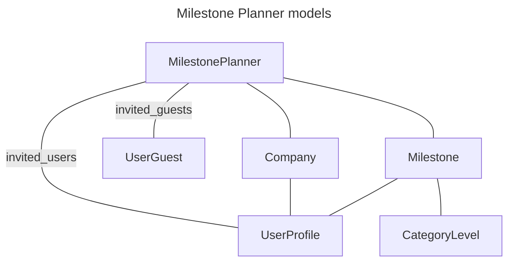

# Milestone Planner

Another one of Abaca’s most important features is the Milestone Planner. This tool helps Entrepreneurs keep track of milestones, which are organized in eight different categories, according to the Venture Investment-Readiness and Awareness Levels (VIRAL) framework. Depending on the amount of the achieved milestones, the user’s level in each category can range from 1 to 9, and the minimum of these eight values is the Company’s Venture Investment Level (VIL).

Milestone Planner ends up providing an alternative way for Entrepreneurs to update their VIL with a higher degree of detail and information, by completing milestones and providing relevant evidence.

These are the models that compose this feature:

## Milestones

In Abaca, the `milestone_planner.models.Milestone` is used to represent milestones, with the following properties:

- `user_profile`
- `category_level`
- `state` – one of the following: `to-be-planned`, `planned`, `in-progress` or `completed`
- `critical` – boolean flag
- `strategy` – text field
- `outcomes` – text field
- `resources` – text field
- `finances_needed` – integer field
- `target_date` – the expected date of completion
- `plan_published` – boolean flag
- `evidence` – a many-to-many relationship with the `matching.models.Reponse` model
- `evidence_published` – boolean flag
- `date_of_completion` – date field

Milestones are closely related to VIRAL – there is a Milestone for each level (there are 9) within each VIRAL category (which are eight), meaning any user has 9x8 = 72 Milestones that can be achieved. One key aspect is that, in the scope of a category, Milestones must be completed sequentially (e.g. the Milestone for a given level can only be marked as complete if all levels below already have completed Milestones). It is possible, however, to edit future Milestones in order to plan ahead without completing previous ones.

## Sharing

Milestone Planner, just like Company Lists, has a sharing feature consisting of public URLs and passcodes. Please refer to the Company Lists documentation for more details.