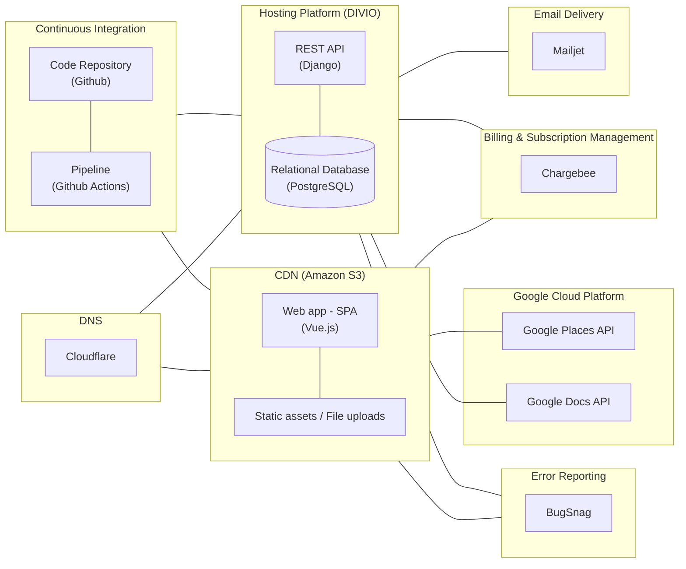

# Tech Stack

## Tools & Services

- Database: PostgreSQL
- Backend: Django (REST API)
- Frontend: Vue.js
- Hosting: DIVIO (Docker), Amazon S3
- CI/CD: GitHub Actions
- Error monitoring: BugSnag
- DNS management: Cloudflare
- Email delivery: Mailjet
- Subscription management: Chargebee
- Location Services: Google Maps API
- UI components: Storybook
- Code coverage: Codecov

### **Database**

- **PostgreSQL**: A powerful open-source relational database management system known for its reliability and robustness. It provides features such as ACID compliance, scalability, and extensibility.

### **Backend**

- **Django (REST API)**: A high-level Python web framework that encourages rapid development and clean, pragmatic design. Utilized for building the backend logic and exposing RESTful APIs to interact with the database.

### **Frontend**

- **Vue.js**: A progressive JavaScript framework for building user interfaces. Vue.js is known for its simplicity, flexibility, and performance, making it an excellent choice for developing interactive frontend components.

### **Hosting**

- **DIVIO (Docker)**: A platform that simplifies the deployment and management of web applications using Docker containers. DIVIO enables seamless scaling, version control, and collaboration among development teams.
- **Amazon S3**: A scalable cloud storage solution provided by Amazon Web Services (AWS). It offers secure and reliable object storage for hosting static assets such as images, videos, and documents.

### **CI/CD**

- **GitHub Actions**: A continuous integration and continuous deployment (CI/CD) platform integrated with GitHub repositories. GitHub Actions automates the software development lifecycle, from building and testing to deployment, streamlining the release process.

### **Error Monitoring**

- **BugSnag**: A comprehensive error monitoring and tracking tool that helps developers identify and prioritize software errors in real-time. BugSnag provides insights into application stability, performance issues, and user impact, facilitating quick resolution of bugs.

### **DNS Management**

- **Cloudflare**: A leading provider of content delivery network (CDN) services, DDoS mitigation, and domain name system (DNS) management. Cloudflare ensures fast and secure access to websites by optimizing content delivery and protecting against cyber threats.

### **Email Delivery**

- **Mailjet**: A cloud-based email delivery service that simplifies email marketing and transactional email sending. Mailjet offers scalable infrastructure, reliable delivery, and advanced features for creating and managing email campaigns.

### **Subscription Management**

- **Chargebee**: A subscription management platform that automates billing, invoicing, and revenue operations for subscription-based businesses. Chargebee integrates with payment gateways and provides flexible subscription plans, billing cycles, and pricing models.

### **Location Services**

- **Google Maps API**: A set of APIs provided by Google for integrating dynamic maps, geocoding, and location-based services into web and mobile applications. Google Maps API enables developers to incorporate interactive maps, location search, and route planning functionality.

### UI Components

- **Storybook**: An open-source tool for developing UI components in isolation for React, Vue, Angular, and more. Storybook provides a visual interface for building, testing, and documenting components outside of the main application, facilitating a streamlined development workflow and improving component reuse. It allows developers to create "stories" that represent different states of UI components, making it easy to showcase and test them interactively.

### **Code Coverage**

- **Codecov**: A leading code coverage reporting tool that integrates with continuous integration (CI) pipelines. Codecov provides detailed insights into test coverage, highlighting which parts of the codebase are tested and which are not. It supports various languages and CI services, offering visual reports and actionable feedback to help improve test coverage and code quality. Codecov's seamless integration with GitHub Actions makes it easy to incorporate coverage reports into the development workflow, ensuring code quality and reliability.

## Core backend dependencies

- [Aldryn Django](https://github.com/divio/aldryn-django)
- [Django REST Framework](https://www.django-rest-framework.org/)
- [django-watson](https://github.com/etianen/django-watson)
- [django-allauth](https://docs.allauth.org/en/latest/)
- [django-modeltranslation](https://django-modeltranslation.readthedocs.io/en/latest/)
- [django-easy-select2](https://django-easy-select2.readthedocs.io/en/latest/)
- [django-sortedm2m](https://github.com/jazzband/django-sortedm2m)

### **Aldryn Django**

- Aldryn Django is a Django-based CMS (Content Management System) platform designed for rapid development and easy management of web content. It provides a customizable and user-friendly interface for creating and editing website content, making it suitable for projects that require robust content management capabilities.

### **Django REST Framework**

- Django REST Framework is a powerful toolkit for building Web APIs in Django. It simplifies the creation of RESTful APIs by providing tools for serialization, authentication, permissions, and more. With Django REST Framework, developers can quickly develop APIs that adhere to best practices and support various data formats, including JSON and XML.

### **django-watson**

- django-watson is a reusable Django application for full-text search. It integrates seamlessly with Django models, allowing developers to perform efficient full-text searches across multiple fields and models. django-watson provides advanced search features, including ranking, filtering, and highlighting, making it ideal for applications that require robust search functionality.

### **django-allauth**

- django-allauth is a flexible authentication and account management solution for Django projects. It provides features such as user registration, email verification, social authentication (OAuth), and account management pages out of the box. django-allauth can be easily customized and extended to fit the specific authentication requirements of a project.

### **django-modeltranslation**

- django-modeltranslation is a Django extension that simplifies the process of translating Django model fields into multiple languages. It allows developers to define translatable fields in their models and provides tools for managing translations through the Django admin interface. django-modeltranslation makes it easy to create multilingual websites without duplicating model fields or modifying database schemas.

### **django-easy-select2**

- django-easy-select2 is a Django app that integrates the Select2 JavaScript library with Django forms and admin fields. Select2 provides a customizable and user-friendly dropdown/select input widget with features such as search, tagging, and AJAX loading. django-easy-select2 simplifies the integration of Select2 with Django forms, allowing developers to enhance the user experience of their applications with minimal effort.

### **django-sortedm2m**

- django-sortedm2m is a Django app that provides sorted many-to-many (M2M) fields for Django models. It allows developers to define M2M relationships between models while maintaining a specific ordering of related objects. django-sortedm2m provides tools for managing the order of related objects through the Django admin interface and simplifies querying and accessing sorted M2M relationships in Django views and templates.

## Architecture diagram

