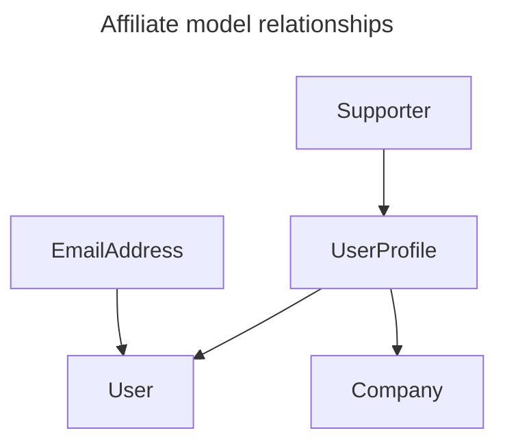

# Users & Authentication

The core model used to represent an Abaca user is Django's default one, `django.contrib.auth.models.User`.

Additionally, a few other custom models are used according to the project's needs:

- `viral.models.Company` represents an actual "customer" of Abaca, the end-user (administrators are also users, but they do not represent any company). These can have one of three possible types:
    - `0: ENTREPRENEUR`
    - `1: SUPPORTER`
    - `2: PARTNER`
- `viral.models.UserProfile` represents an association between a `User` and a `Company`, with a few additional pivot fields:
    - `uid`, autogenerated, is part of the URL of public profile pages
    - `source` is a relation to the Affiliate the user submitted during its sign up process
- `matching.models.Supporter` holds specific properties exclusive to Supporters, and is associated with a `UserProfile`
- `allauth.account.models.EmailAddress` is associated with the `User` model, and holds the `verified` and `primary` boolean flags – after signing up, users are asked to verify their email address by following a link sent to their inbox. Additionally, Abaca allows users to change their email address.

## Guests

It is possible to use Abaca as a Guest, without registering for an account, in particular when accessing shared content such as Company Lists or the Milestone Planner. We have the `viral.models.UserGuest` model to represent these users and keep track of them.

## Pending Users

When a new user enters Abaca, they are presented with an Affiliate flow, which they can submit without creating an account first. If the user is not already authenticated, they’re prompted to enter a few details, such as a name and an email address, before progressing. At this point, an Abaca account is created for that user (with all models involved). However, the user still isn’t allowed to login and access other parts of Abaca, as they haven’t set a password. We call users in this situation *Pending Users*. This is a legacy feature that should be revisited in the near future as it has caused a few issues in the past. Once a Pending User completes the Affiliate submission, they are invited to set a password to actually join Abaca.

## Email addresses

Abaca uses a typical email address verification system provided by the [django-allauth](https://docs.allauth.org/) library. Furthermore, users are allowed to change the email address associated with their account, which is used to authenticate in Abaca. However, once a user submits a new email address in the appropriate form, it is not immediately replaced. It is stored in the database, alongside the original one, with the properties `verified == False` and `primary == False`. While the same User can have multiple Email Addresses associated with his account, only a single one can be set as primary. When the user opens the verification link sent from Abaca to their inbox, that new Email Address becomes the primary one, and any remaining ones are deleted.

## Log in as user

For debugging purposes, Abaca has a user impersonation feature available to administrators. In Django’s admin panel, in the details page of a Company, on the top right corner, there is a “log in as user” button. When clicked, a valid authentication token for the User associated with the selected Company is created and the user is redirected to Abaca’s frontend, already authenticated.